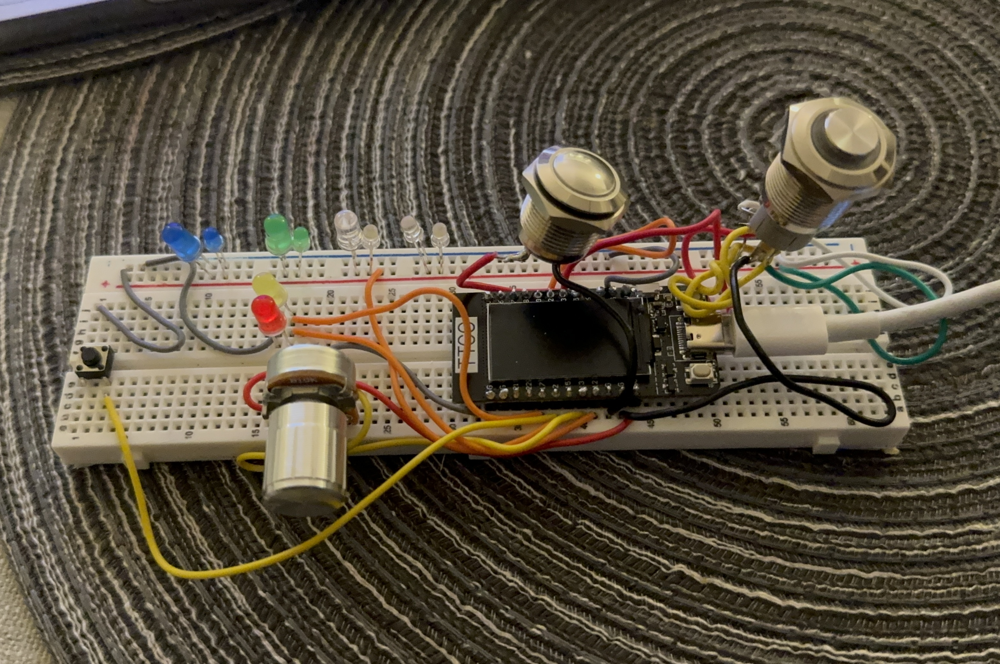
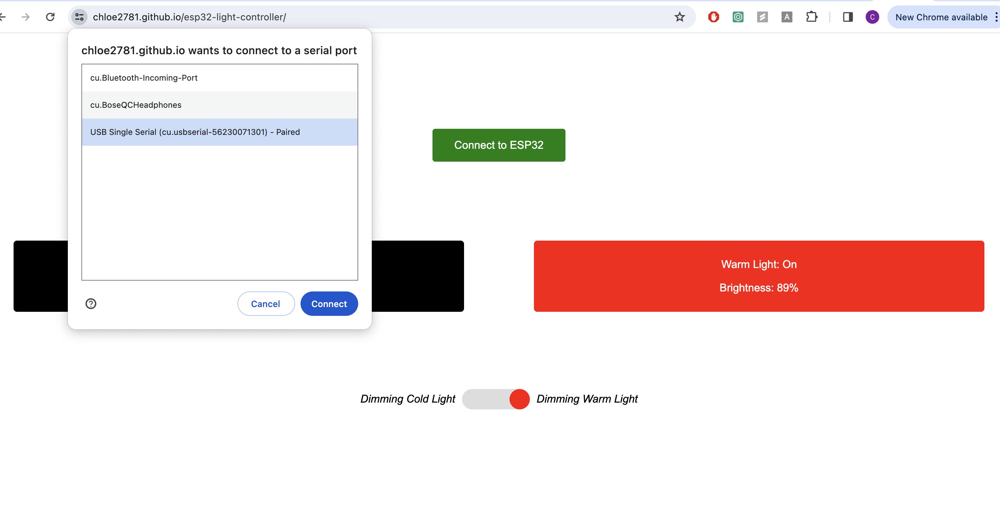
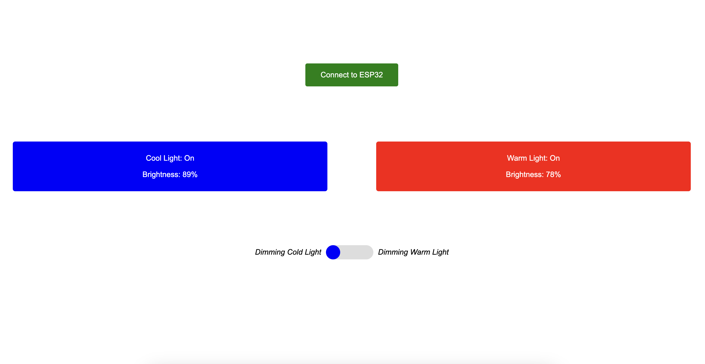

# esp32-light-controller
Building a light house using LED lights and real time display on a website through serial connection with ESP32.

Check out my blog here: https://chloe2781.github.io/esp32-light-controller/

## Overview
This project transforms a simple cardboard enclosure into an interactive light display using an ESP32 TTGO T-Display, buttons, LEDs, and a potentiometer. Designed to explore the interplay between physical and digital interfaces, it invites users to play with light settings through tactile inputs and a web-based UI. Inspired by the warmth of a cozy home, it serves as a bridge between art, technology, and daily life.

## Installation
### Hardware Requirements:
- ESP32 TTGO T-Display
- Tactile buttons (x3)
- Potentiometer
- LEDs (Red, Yellow, Blue, Green)
- Breadboard and jumpers
  
### Software Requirements:
- Arduino IDE for ESP32 firmware
- Any modern web browser for the UI
  
### Setup Instructions:
1. Firmware Upload: Open the Arduino IDE, and upload the provided .ino file to the ESP32.
2. Web UI: Open the index.html file in a web browser to access the light control interface.

### Usage
- Light Control: Use the buttons on the device to toggle between warm and cool lights. Adjust brightness with the potentiometer.
- Web Interface: Control the lights on the enclosure and watch the web UI update information. Connect through the serial port to synchronize device status in real-time.

## Visual Documentation
### Internal Setup

Image 1: Breadboard setup with proper button/potentiometer/LED connections.

### Enclosure

Image 2: Cardboard Housing Enclosure Left

Image 3: Cardboard Housing Enclosure Right

Image 4: Cardboard Housing Enclosure Front

Image 5: Cardboard Housing Enclosure Back

### Web UI

Image 6: Web UI Connection

Image 7: Web UI Control Panel

## Challenges and Learnings
Navigating the complexities of serial communication and web development underscored the importance of intuitive design. This journey emphasized user experience in melding physical interaction with digital feedback.

## Contribute
Feel free to fork the repository, submit pull requests, or report issues to enhance the project!
